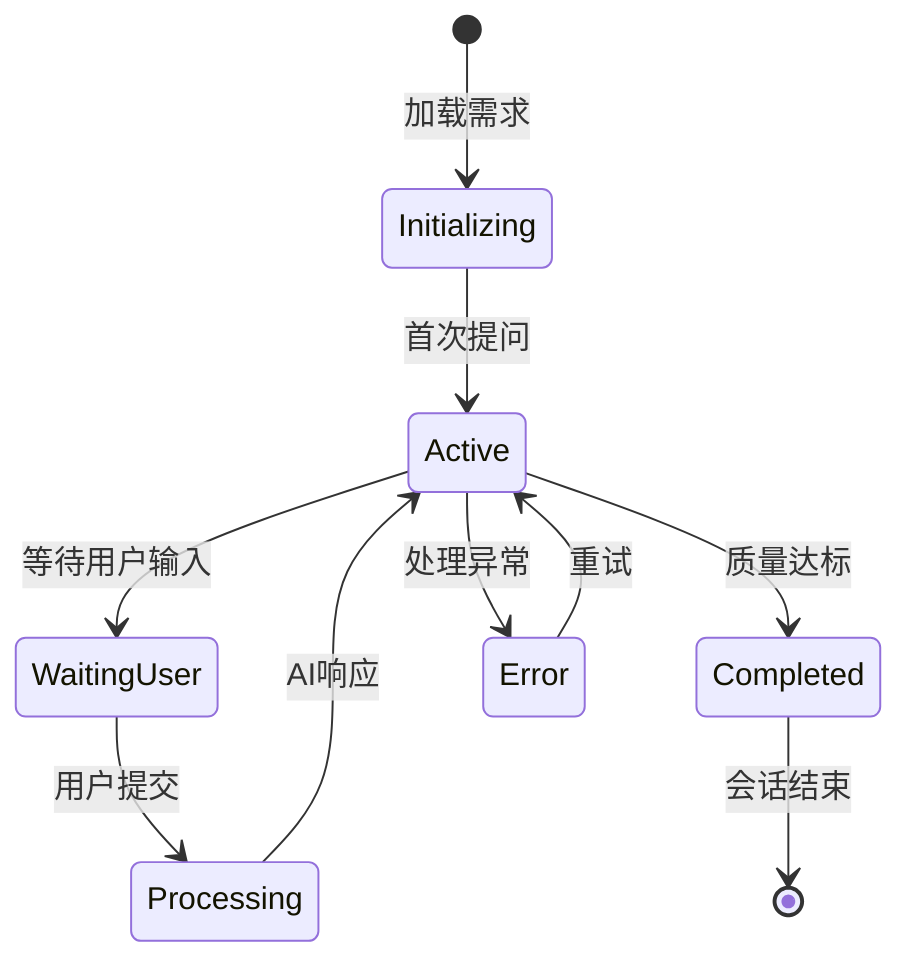

# Design: AI 需求澄清模块

**设计 ID**: DESIGN-REQ-101 | **版本**: 1.0 | **日期**: 2026/3/13

## 1. Overview（概述）

### 设计目标
在需求详情页集成AI驱动的对话澄清功能，通过多轮交互帮助产品经理完善需求描述，提升需求质量。系统需实现AI主动提问、实时结构化输出、UI确认交互及需求质量评估闭环。

### 范围
- **功能范围**：对话界面、AI提问引擎、结构化输出模块、需求质量评估、UI确认弹框
- **非范围**：需求文档自动生成、需求历史版本管理（仅评估当前版本）

### 关联提案
- REQ-101：需求澄清模块核心需求
- 集成至需求管理系统（如JIRA、禅道）的详情页

## 2. Architecture Design（架构设计）

### 2.1 System Context（系统上下文）
```
┌─────────────────────┐     ┌──────────────────┐     ┌─────────────────┐
│  需求详情页 (Web)   │◄───►│  AI澄清模块       │◄───►│  AI服务        │
│  (产品经理操作界面)  │     │  (核心业务逻辑)   │     │  (LLM推理)     │
└─────────────────────┘     └──────────────────┘     └─────────────────┘
         │                           │
         ▼                           ▼
┌─────────────────────┐     ┌──────────────────┐     ┌─────────────────┐
│  需求数据库         │     │  对话历史存储    │     │  知识库        │
│  (需求原始数据)     │     │  (Redis/MongoDB) │     │  (领域知识)    │
└─────────────────────┘     └──────────────────┘     └─────────────────┘
```

### 2.2 Component Diagram（组件图）
```
┌─────────────────────────────────────────────────────────────┐
│                    AI澄清模块                               │
├─────────────────────────────────────────────────────────────┤
│ ┌─────────────┐ ┌──────────────┐ ┌─────────────────────┐   │
│ │ 对话管理器  │ │ AI提问引擎   │ │ 结构化输出器       │   │
│ │ - 会话状态  │ │ - 问题生成   │ │ - JSON Schema验证  │   │
│ │ - 上下文维护│ │ - 多轮对话   │ │ - UI组件映射       │   │
│ └─────────────┘ └──────────────┘ └─────────────────────┘   │
│                                                             │
│ ┌─────────────┐ ┌──────────────┐ ┌─────────────────────┐   │
│ │ 质量评估器  │ │ UI渲染引擎   │ │ 数据持久层         │   │
│ │ - 完整性检查│ │ - 弹框渲染   │ │ - 对话记录         │   │
│ │ - 逻辑验证  │ │ - 实时更新   │ │ - 需求变更追踪     │   │
│ │ - 风险识别  │ └──────────────┘ └─────────────────────┘   │
│ └─────────────┘                                          │
└─────────────────────────────────────────────────────────────┘
```

### 2.3 Data Model（数据模型）
```json
// 对话会话
{
  "sessionId": "string",
  "requirementId": "string",
  "createdAt": "datetime",
  "messages": [
    {
      "id": "string",
      "type": "user|ai|system",
      "content": "string",
      "timestamp": "datetime",
      "metadata": {
        "questionId": "string",
        "responseOptions": ["string"],
        "confirmed": "boolean"
      }
    }
  ],
  "structuredOutput": {
    "goal": "string",
    "scope": ["string"],
    "constraints": ["string"],
    "acceptanceCriteria": ["string"],
    "risks": ["string"]
  },
  "qualityScore": {
    "completeness": 0.0,
    "consistency": 0.0,
    "riskLevel": "low|medium|high"
  }
}
```

## 3. Technical Solution（技术方案）

### 3.1 Key Technologies（关键技术选型）
| 技术 | 选型理由 |
|------|----------|
| 前端框架 | React + TypeScript（组件化UI，支持实时渲染） |
| 后端框架 | Spring Boot 3.x（Java生态成熟，易于集成） |
| AI引擎 | OpenAI GPT-4/Claude 3（高质量对话生成） |
| 数据库 | MongoDB（对话历史JSON存储） + Redis（会话缓存） |
| 消息队列 | Kafka（异步处理AI请求，削峰填谷） |
| 实时通信 | WebSocket（实时更新对话状态） |

### 3.2 API Definitions（接口定义）
```typescript
// 对话初始化
POST /api/v1/clarification/sessions
Request: { requirementId: string }
Response: { 
  sessionId: string,
  initialMessage: string,
  structuredOutput: object
}

// 用户消息发送
POST /api/v1/clarification/{sessionId}/messages
Request: { content: string, type: "user" }
Response: { 
  aiResponse: {
    content: string,
    type: "ai",
    questionId: string,
    responseOptions?: string[]
  },
  updatedStructuredOutput: object
}

// 确认/修改结构化输出
PUT /api/v1/clarification/{sessionId}/structured-output
Request: { 
  field: string,
  value: any,
  confirmed: boolean
}
Response: { 
  updatedOutput: object,
  qualityMetrics: object
}

// 获取质量评估报告
GET /api/v1/clarification/{sessionId}/quality-report
Response: {
  completeness: number,
  consistencyIssues: string[],
  riskFactors: string[],
  recommendations: string[]
}
```

### 3.3 Business Logic（业务逻辑）
#### 核心流程
1. **初始化阶段**
   - 加载原始需求文本
   - AI生成首轮澄清问题（基于预设模板）
   - 初始化结构化输出框架

2. **对话循环**
   - 用户输入 → 上下文更新 → AI问题生成 → 结构化更新
   - 关键决策点：当质量评分>阈值时触发"需求完成"提示

3. **状态机**


### 3.4 Error Handling（错误处理）
| 错误码 | 描述 | 处理策略 |
|--------|------|----------|
| AI_001 | AI服务超时 | 重试3次，降级为预设问题模板 |
| UI_002 | 结构化输出冲突 | 提供手动合并选项 |
| DB_003 | 会话存储失败 | 本地缓存+告警通知 |
| VAL_004 | 输入验证失败 | 返回具体字段错误 |

## 4. Deployment（部署）

### 部署架构
- **容器化**：Docker + Kubernetes
- **环境**：开发/测试/生产三环境隔离
- **扩缩容**：基于对话队列长度自动扩缩（HPA策略）

### 资源需求
- **最小配置**：2核4GB，100GB存储
- **推荐配置**：4核8GB，500GB SSD
- **AI服务配额**：1000 QPM（每分钟查询数）

### 监控指标
- 对话响应时间（P95 < 2s）
- AI服务成功率（>99%）
- 用户满意度评分（内嵌反馈机制）

## 5. Security Considerations（安全考量）

### 数据安全
- 对话内容加密存储（AES-256）
- 敏感信息脱敏处理（如客户名称）
- 审计日志记录所有操作

### 访问控制
- 基于RBAC的权限管理
- 会话级别的数据隔离
- API调用频率限制（100次/分钟/用户）

### 输入安全
- 所有用户输入进行XSS过滤
- AI输出内容安全扫描
- 结构化输出Schema严格验证

## 6. Performance Considerations（性能考量）

### 缓存策略
- Redis缓存活跃会话（TTL 30min）
