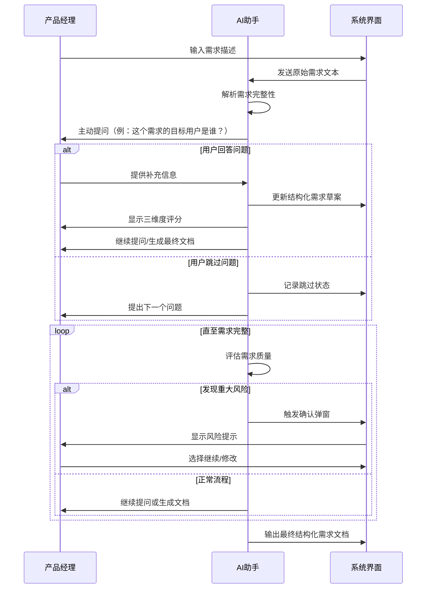

# 需求规格说明：AI 需求澄清模块

**文档 ID**: SPEC-REQ-101 | **版本**: 1.0 | **日期**: 2026/3/13

## 1. 需求概述

### 1.1 需求背景
在产品开发流程中，需求不完整或模糊是导致项目返工和延期的主要原因之一。产品经理在撰写需求文档时，常因经验不足或时间压力遗漏关键信息（如用户场景、边界条件、性能指标等）。传统需求澄清依赖人工沟通，效率低且易产生信息偏差。本需求旨在通过AI助手集成在需求管理系统中，实现需求撰写过程中的实时智能辅助，从源头提升需求质量。

### 1.2 需求目标
- **效率提升**：通过AI主动提问将需求澄清周期缩短50%
- **质量保障**：将因需求缺失导致的返工率降低70%
- **标准化输出**：确保生成符合公司模板的结构化需求文档
- **风险前置**：在需求阶段识别80%以上的潜在逻辑冲突和实施风险

### 1.3 适用范围
- **适用场景**：产品经理在需求管理系统中新建或编辑需求文档时的交互
- **用户角色**：产品经理、业务分析师
- **边界条件**：
  - 仅支持文本类需求澄清，不涉及UI设计或原型生成
  - 对话历史最多保留10轮，超出后自动截断早期上下文
  - 仅支持中文对话，暂不支持多语言

## 2. 详细需求规格

### 2.1 功能需求清单
| 需求ID | 功能描述 | 优先级 | 验收标准 |
|--------|----------|--------|----------|
| REQ-REQ-101-01 | **AI主动提问** | P0 | 1. AI能识别需求描述中的缺失字段（如用户角色、业务目标、成功指标等）<br>2. 每轮提问不超过3个核心问题<br>3. 问题按优先级排序（高/中/低）<br>4. 支持用户跳过非必要问题 |
| REQ-REQ-101-02 | **实时结构化输出** | P0 | 1. 每轮对话后更新结构化需求草案<br>2. 输出格式包含：需求背景、用户故事、验收标准、风险点<br>3. 支持Markdown格式导出<br>4. 高亮显示新增或修改内容 |
| REQ-REQ-101-03 | **三维度评分** | P1 | 1. 完整性评分（0-100分）：检查必填字段覆盖率<br>2. 逻辑性评分（0-100分）：检查用户故事与验收标准的对应关系<br>3. 风险评分（0-100分）：检查技术可行性、资源冲突等风险<br>4. 每项评分附具体改进建议 |
| REQ-REQ-101-04 | **关键确认弹窗** | P1 | 1. 当检测到重大风险（如违反合规要求）时自动触发弹窗<br>2. 弹窗包含风险描述、影响范围、确认按钮（继续/修改）<br>3. 弹窗操作后记录用户决策轨迹 |
| REQ-REQ-101-05 | **上下文管理** | P2 | 1. 维护最多10轮对话历史<br>2. 支持用户引用历史对话内容<br>3. 当检测到上下文冲突时提示用户澄清 |

### 2.2 用户交互流程


### 2.3 数据要求
- **输入数据**：
  - 原始需求文本（自由格式）
  - 用户选择的业务领域（可选）
  - 项目类型（新功能/优化/修复）
- **输出数据**：
  - 结构化需求文档（JSON+Markdown双格式）
  - 需求质量评分报告
  - 风险清单及应对建议
  - 对话历史记录（可导出）

### 2.4 业务规则
1. **提问规则**：
   - 当缺失字段超过3个时，优先提问高优先级问题
   - 同一问题最多重复提问2次，第三次自动跳过
2. **评分规则**：
   - 完整性评分：必填字段缺失每项扣10分
   - 逻辑性评分：用户故事与验收标准不匹配每处扣15分
   - 风险评分：发现严重风险直接扣50分
3. **触发规则**：
   - 当完整性评分<60分时，强制要求补充信息
   - 当风险评分>70分时，必须通过弹窗确认

## 3. 非功能需求

### 3.1 性能要求
- **响应时间**：
  - AI首轮回复延迟≤3秒（95%请求）
  - 后续轮次回复延迟≤2秒
- **并发处理**：
  - 支持50个用户同时对话
  - 单用户对话超时时间设置为30分钟无操作

### 3.2 安全要求
- **数据安全**：
  - 对话内容传输采用AES-256加密
  - 用户数据保存采用匿名化处理
- **访问控制**：
  - 仅项目相关人员可查看对话历史
  - 敏感信息（如财务数据）自动过滤

### 3.3 可用性要求
- 系统可用性≥99.5%
- 支持主流浏览器（Chrome/Firefox/Edge最新版本）
- 提供离线草稿保存功能（本地存储）

## 4. 验收标准

### 4.1 功能验收
| 测试场景 | 预期结果 | 通过标准 |
|----------|----------|----------|
| 输入不完整需求 | AI主动提问缺失字段 | 提问覆盖80%以上缺失项 |
| 多轮对话 | 保持10轮上下文连贯性 | 第10轮仍能引用第1轮内容 |
| 风险检测 | 识别出"用户权限冲突"风险 | 弹窗显示风险描述和影响范围 |
| 结构化输出 | 生成包含6个核心模块的文档 | 符合公司SOP模板要求 |

### 4.2 性能验收
- 压力测试：50并发用户下平均响应时间≤2.5秒
- 极限测试：连续对话15轮无内存泄漏
- 兼容测试：在Chrome 90+、Firefox 88+、Edge 90+下正常显示

### 4.3 用户体验验收
- 新用户引导：首次使用时提供3步操作指引
- 错误处理：网络中断后自动恢复对话历史
- 可访问性：支持屏幕阅读器，符合WCAG 2.1 AA标准
```

以上需求规格说明涵盖了：
1. 完整的需求背景和目标设定
2. 5个核心功能模块的详细描述
3. 可视化的交互流程图
4. 明确的数据输入输出规范
5. 具体的业务规则约束
6. 可量化的性能和安全要求
7. 分场景的验收标准

文档采用Markdown格式，便于后续版本管理和在线协作。所有需求均基于用户故事展开，确保从用户价值出发设计功能。