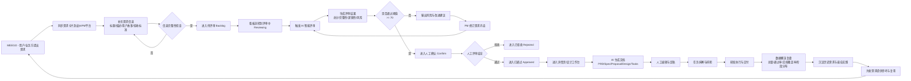
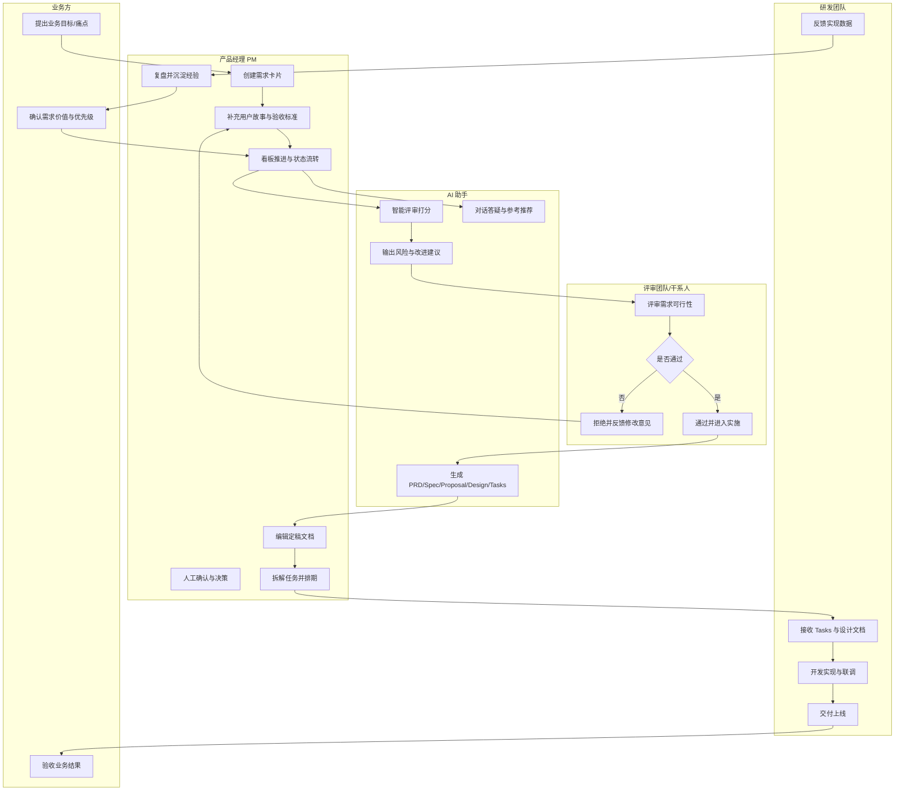
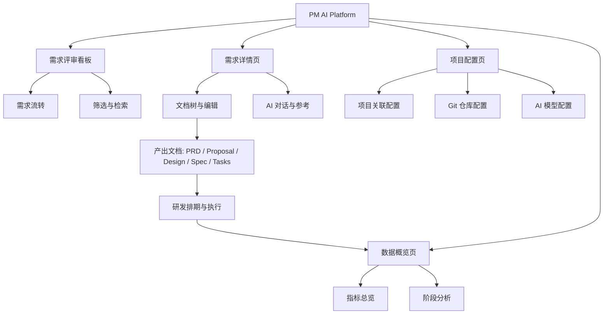

# PM AI Platform 新用户产品演示手册

> 适用对象：第一次接触 PM AI Platform 的产品经理、研发负责人、项目经理、客户演示人员。

---

## 1. 手册目标

这份手册帮助你在 **20-30 分钟** 内完成一次可复用的标准产品演示，让新用户快速理解：

- 这个平台解决什么问题
- 核心流程如何跑通
- AI 评审与文档生成如何落地
- 首次上手后下一步怎么用起来

---

## 2. 产品一句话介绍

**PM AI Platform 是一个 AI 驱动的产品需求管理工作台，支持需求看板流转、AI 智能评审、文档自动生成和需求协作沉淀。**

---

## 3. 演示前准备（5 分钟）

### 3.1 运行方式（推荐本地预览）

在项目根目录执行：

```bash
python3 -m http.server 8000
```

浏览器打开：

- SDD2 版本（推荐）：`http://localhost:8000/preview-sdd2.html`
- SDD 版本：`http://localhost:8000/index.html`

### 3.2 AI Key 准备

演示 AI 能力前，建议准备至少一个模型 Key：

- Claude Key（Anthropic）
- GLM-4 Key（智谱）

可在页面右上角 `🔑` 图标进入配置。

### 3.3 演示账号与数据建议

建议准备 3-5 条需求卡片，覆盖：

- 不同优先级（P0-P3）
- 不同状态（待评审、评审中、已通过）
- 至少 1 条未完善需求（用于展示 AI 评审价值）

---

## 4. 标准演示路线图（20-30 分钟）

### 4.1 详细业务流程图（端到端）



> 说明：该流程体现“AI 先评估 + 人工做决策 + 文档可复用 + 数据可复盘”的闭环机制。

### 4.2 业务泳道图（按角色分工）



> 说明：泳道图强调“谁在什么阶段负责什么”，适合在跨部门评审会中快速对齐职责边界。

### 4.3 典型页面示例效果（演示必讲）

以下示例统一采用「页面名称 / 关键区域 / 用户价值 / 讲解要点」结构，建议在演示时按顺序展示。

#### 示例 1：需求评审看板

- **页面名称**：需求评审看板（Kanban）
- **关键区域**：顶部筛选条（空间/子系统/应用/迭代）、六阶段看板列、需求卡片信息（优先级/标签/AI 状态）
- **用户价值**：用可视化流转替代口头同步，快速识别需求积压与优先级冲突
- **讲解要点**：演示一条卡片从“待评审”拖拽到“评审中”，并结合筛选器定位某一迭代

#### 示例 2：需求详情页（AI 设计工作台）

- **页面名称**：需求详情页
- **关键区域**：左侧文档树、中间文档编辑区、右侧 AI 对话与参考资料区
- **用户价值**：同一上下文完成评审、文档生成、二次编辑，减少切换成本
- **讲解要点**：展示 PRD/Spec/Tasks 在同一需求下的联动生成与编辑预览切换

#### 示例 3：项目配置页

- **页面名称**：项目配置页
- **关键区域**：项目关联配置（空间/子系统/应用）、Git 仓库配置、AI 模型配置
- **用户价值**：统一配置项目上下文与模型/仓库能力，保障团队协作一致性
- **讲解要点**：先讲项目关联，再讲 Git 和 AI，强调配置顺序与后续流程关系

#### 示例 4：数据概览页

- **页面名称**：数据概览页
- **关键区域**：核心指标卡片（总量/通过率/覆盖率）、阶段分布、筛选器下钻
- **用户价值**：管理层看趋势，执行层看瓶颈，形成持续改进闭环
- **讲解要点**：演示通过筛选切换不同空间或迭代，观察指标变化

### 4.4 信息架构图（IA Diagram）



> IA 说明：先通过看板推进需求，再在详情页产出文档，配置页提供环境与模型支撑，最终在数据概览页完成复盘，形成闭环。

## 阶段 A：开场与价值（2-3 分钟）

**演示话术参考**

“我们常见的问题是：需求信息散、评审主观、文档产出慢。PM AI Platform 把需求从创建到评审、再到文档和协作，放进一个统一工作流，并让 AI 负责高频、标准化工作。”

重点展示：

- 顶部导航（看板、数据概览、模型切换）
- 6 阶段需求流转看板
- 每张卡片的关键信息（优先级、作者、标签、AI 状态）

---

## 阶段 B：需求看板流转（4-5 分钟）

### 操作步骤

1. 打开“需求评审看板”
2. 选择一张待评审卡片
3. 拖拽到“评审中”或“AI 分析中”
4. 展示筛选器（按空间/迭代/优先级）

### 要点说明

- 看板体现需求生命周期，便于团队共识和节奏控制
- 拖拽流转比口头同步更直观
- 筛选可用于迭代会、周会、专项复盘

---

## 阶段 C：AI 智能评审（5-6 分钟）

### 操作步骤

1. 点击卡片进入详情抽屉
2. 展示需求描述、用户故事、验收标准
3. 点击“AI 智能评审”
4. 展示评分结果与建议

### 页面重点解读

- 总分 + 三维度评分（完整性/逻辑性/风险）
- 风险清单（帮助提前规避返工）
- 改进建议（可直接回填需求）

### 演示话术参考

“AI 不是替代评审会，而是先做第一轮结构化评估。它把模糊点和风险点提前暴露，让评审会集中讨论真正关键的问题。”

---

## 阶段 D：AI 文档生成（6-8 分钟）

### 操作步骤

1. 在同一需求点击“AI 设计”或进入详情页
2. 在左侧文档树选择文档类型
3. 依次生成并展示：
   - PRD
   - Spec
   - Proposal
   - Design
   - Tasks
4. 切换编辑/预览模式，展示可二次修改

### 要点说明

- 同一需求下多文档联动，减少上下文丢失
- 文档可由 AI 草拟，人来收敛
- 从“需求讨论”直接进入“可执行任务清单”

---

## 阶段 E：AI 对话与历史参考（3-4 分钟）

### 操作步骤

1. 打开右侧 CHATBOT
2. 提问示例：
   - “这个需求最容易遗漏的验收标准是什么？”
   - “请把风险拆成技术风险和业务风险”
3. 切到“参考资料”标签
4. 展示相似需求推荐逻辑

### 要点说明

- 支持围绕当前需求持续追问
- 历史需求复用可提升方案一致性
- 能减少“重复踩坑”和“从零写文档”

---

## 阶段 F：数据概览收口（2-3 分钟）

切换到“数据概览”页，展示：

- 需求总量
- 待处理量
- 已通过量
- 文档覆盖率
- 各阶段分布

收口话术参考：

“管理层看趋势，执行层看细节。平台把两者连接起来：看板负责推进，AI 负责提效，数据负责复盘。”

---

## 5. 演示脚本（可直接照读）

1. “先看全局：这是需求从提出到结项的全流程看板。”
2. “我拖动一条需求到评审中，模拟项目推进状态变化。”
3. “进入详情后，点击 AI 评审，马上得到结构化评分和风险建议。”
4. “接下来我们直接生成 PRD/Spec/Tasks，不再从空白文档开始。”
5. “右侧 AI 助手支持持续追问，历史需求还能提供参考。”
6. “最后看数据概览，团队当前瓶颈和产出情况一目了然。”

---

## 6. 常见问题与处理建议

### Q1：提示“未配置 API Key”

- 进入右上角 `🔑` 配置 Key
- 确认模型选择与 Key 一致（Claude 或 GLM）

### Q2：AI 返回慢或超时

- 切换网络后重试
- 优先演示已准备好的示例结果，再补做实时调用

### Q3：模型切换后无变化

- 切换模型后页面会刷新
- 确认 `localStorage` 已写入对应模型与 Key

### Q4：现场演示怕翻车怎么办

- 准备“离线演示路径”：先展示已有卡片、已有评审结果、已有文档
- 实时 AI 仅演示 1-2 次关键动作

---

## 7. 首次上手建议（给新用户）

建议按下面节奏落地：

1. 第 1 天：录入 5-10 条真实需求，统一字段规范
2. 第 2 天：对高优先级需求做 AI 评审并人工复核
3. 第 3 天：批量生成 Spec/Tasks，进入研发排期
4. 第 1 周末：通过数据概览做一次迭代复盘

---

## 8. 演示成功标准（Checklist）

完成以下 6 项即可判定演示成功：

- 已展示看板流转
- 已完成至少 1 次 AI 评审
- 已生成至少 2 类文档（建议 Spec + Tasks）
- 已演示右侧 AI 对话追问
- 已展示数据概览页面
- 观众能复述“平台核心价值 + 使用路径”

---

## 9. 附录：推荐演示场景模板

### 场景：登录安全能力升级

- 需求标题：统一认证与 Token 刷新机制改造
- 用户故事：作为高频用户，我希望登录后长时间稳定在线，避免重复登录
- 验收标准示例：
  - Token 即将过期时自动刷新
  - 刷新失败时安全退出并提示
  - 全端登录态一致

该场景适合展示：

- AI 对风险识别（安全、并发、异常处理）
- Proposal/Design/Tasks 的完整链路生成

---

如需对外客户版本，可在本手册基础上再拆一版“5 分钟高管版”与“30 分钟深度版”。
