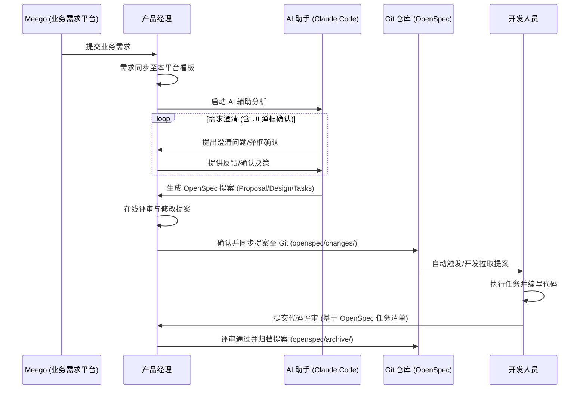
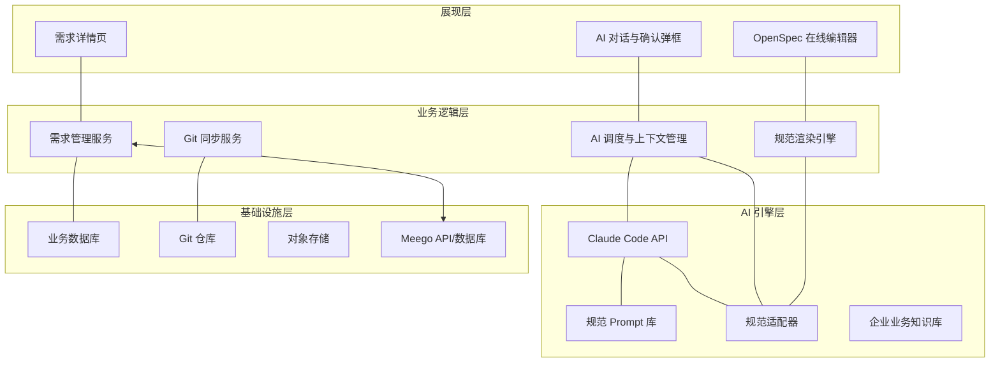
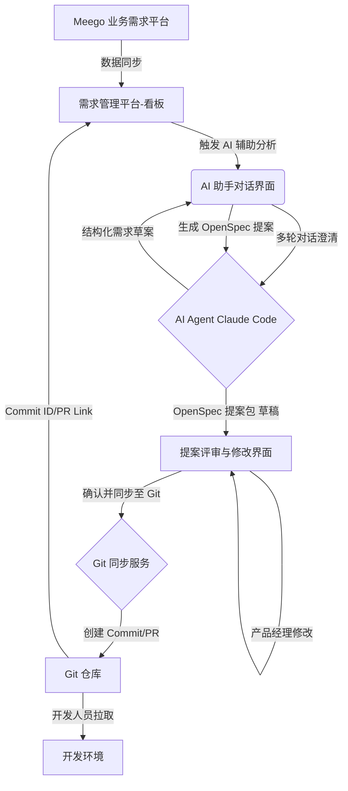

# 智能需求分析与设计功能产品设计文档

**作者**: YUANWEN AI
**日期**: 2026年2月24日
**最后更新**: 2026年3月8日（补充多维筛选、多提案、AI Skill 管理、历史需求参考、多模型支持、离线兜底等实现功能）

## 1. 功能概述

本功能旨在将需求管理平台与先进的 AI 辅助设计能力（基于 Claude Code）及标准化设计规范（OpenSpec）深度融合，构建一个从业务需求提出、多轮对话澄清、自动化提案生成、在线评审到 Git 仓库同步的端到端智能需求分析与设计工作流。核心目标是提升产品经理的需求理解效率、标准化设计文档质量，并加速开发团队的需求落地速度。

## 2. 用户旅程

以下是产品经理使用“智能需求分析与设计”功能的典型用户旅程：

| 步骤 | 角色 | 动作 | 系统响应 | 产出物 |
| :--- | :--- | :--- | :--- | :--- |
| **1. 触发需求分析** | 业务方/产品经理 | 在需求管理平台创建或选择一个业务需求，点击“AI 辅助分析”按钮。 | 系统启动 AI 助手，加载业务需求上下文。 | 业务需求 ID |
| **2. 多轮对话澄清** | 产品经理 & AI 助手 | 产品经理与 AI 助手进行多轮对话，澄清需求细节、边界、用户场景等。AI 助手主动提问，产品经理补充信息。 | AI 助手根据对话内容逐步完善对需求的理解，并实时更新结构化需求草案。 | 结构化需求草案 |
| **3. OpenSpec 提案生成** | 产品经理 | 对话结束后，产品经理指示 AI 助手生成 OpenSpec 提案。 | AI 助手根据结构化需求草案，结合 OpenSpec 规范，自动生成 `proposal.md`、`design.md` 和 `specs/delta.md` 等文件。 | OpenSpec 提案包 (草稿) |
| **4. 提案在线评审** | 产品经理 | 产品经理在平台内查看 AI 生成的提案内容，进行修改和完善。 | 平台提供富文本编辑器和 OpenSpec 预览功能，支持产品经理直接编辑和版本管理。 | OpenSpec 提案包 (待确认) |
| **5. 提案确认与 Git 同步** | 产品经理 | 产品经理确认提案无误后，点击“确认并同步至 Git”按钮。 | 系统自动在 Git 仓库的指定分支创建或更新 `openspec/changes/<change-name>/` 目录，并提交提案文件。 | Git Commit / Pull Request |
| **6. 开发拉取与执行** | 开发人员 | 开发人员从 Git 仓库拉取最新代码，获取 OpenSpec 提案，开始任务开发。 | Git 仓库更新，开发人员获取最新提案。 | 代码实现 |
| **7. 评审与归档** | 开发人员/产品经理 | 开发人员完成任务后，产品经理可基于 OpenSpec 提案进行代码评审。任务完成后，提案可被归档。 | 平台记录评审结果，Git 仓库进行合并，OpenSpec 提案归档。 | 归档记录 |

## 3. 功能模块设计

### 3.0 需求列表页面 (看板视图)

*   **核心功能**: 提供一个直观的看板视图，展示从 Meego 同步过来的业务需求，并支持产品经理进行需求状态流转和管理。
*   **页面布局**: 采用多列看板形式，每列代表一个需求处理阶段，例如：“待评审”、“评审中”、“AI 分析中”、“人工确认”、“已通过”、“已拒绝”。
*   **需求卡片**: 每个需求以卡片形式展示，包含以下信息：
    *   **需求编号**: 如 REQ-001
    *   **优先级/阶段**: 如 P1/P2
    *   **标题**: 业务需求的简要描述
    *   **标签**: 业务领域、功能类型等
    *   **提交日期**: 业务需求提交时间
    *   **负责人**: 产品经理姓名
    *   **AI 评审分数**: AI 对需求清晰度、完整性、可实现性等方面的评分（如 72 分）
    *   **AI 建议**: AI 对需求的初步建议，如“建议通过”、“建议修改”
*   **交互操作**:
    *   **拖拽流转**: 产品经理可通过拖拽需求卡片，改变其所处的阶段。
    *   **点击查看详情**: 点击卡片进入需求详情页，启动 AI 辅助分析流程。
    *   **筛选与排序**: 支持按负责人、优先级、状态等进行筛选和排序。
    *   **多维筛选**: 支持空间 / 子系统 / 应用 / 迭代四个维度的多选联动筛选，各维度颜色独立区分，筛选条件实时组合过滤看板卡片。
    *   **卡片 Badge 快速筛选**: 点击需求卡片上的维度标签（如空间、迭代）可一键触发对应维度筛选，无需打开筛选面板。
*   **Meego 数据同步**: 
    *   **同步机制**: 定时从 Meego 拉取新的业务需求，并同步需求状态变更。
    *   **数据映射**: 将 Meego 中的需求字段映射到本平台的需求卡片信息。
    *   **状态回写**: 可选支持将本平台的需求处理状态回写至 Meego。

### 3.1 AI 需求澄清模块

*   **核心功能**: 提供一个集成在需求详情页面的对话界面，产品经理可与 AI 助手进行自然语言交互。
*   **AI 助手能力**: 
    *   **主动提问**: 根据业务需求内容，AI 助手主动提出关键问题，如“用户群体是谁？”、“核心业务流程是什么？”、“有哪些异常情况需要考虑？”等。**对于需要产品经理明确决策或关键信息补充的场景，AI 助手将以 UI 弹框的形式进行提问和确认，以确保信息准确性和用户专注度。**
    *   **AI 评审与评分**: AI 助手在需求澄清过程中，会持续对需求的清晰度、完整性、潜在风险等进行评估，并给出“AI 评审分数”和“AI 建议”（如“建议通过”、“建议修改”），这些信息将展示在需求卡片和详情页中，辅助产品经理决策。
    *   **上下文理解**: 持续理解对话上下文，引用历史对话内容，避免重复提问。
    *   **结构化输出**: 实时将对话中澄清的需求点提炼并结构化，例如用户故事、功能列表、非功能性需求等。
    *   **知识库集成**: 可选集成公司内部知识库，辅助 AI 助手理解特定业务术语和规范。
*   **交互界面**: 类似聊天窗口，支持 Markdown 格式输入和输出，可引用需求管理平台中的其他信息。**关键确认和提问将通过独立的 UI 弹框（Dialog/Modal）进行渲染，以提升用户体验和信息聚焦。**
*   **多 AI 模型支持**: 系统支持多个 AI 模型提供商，通过统一的 `AIClient` 接口调用，产品经理可在项目配置页按需切换：
    *   **Claude（Anthropic）**: 默认模型，适合高质量文档生成与深度需求分析。
    *   **GLM-4（智谱）**: 国内可用替代模型，适合网络受限环境。

### 3.2 规范框架扩展模块

*   **核心功能**: 支持集成和管理多种 Spec-Driven Development (SDD) 框架，如 OpenSpec、Open-Kit 等，允许产品经理根据项目需求选择合适的规范。
*   **框架管理**: 
    *   **插件化机制**: 提供插件化的框架接入机制，方便未来扩展新的 SDD 规范。
    *   **模板配置**: 为每种框架提供可配置的模板，包括 `proposal.md`、`design.md`、`tasks.md` 等文件的结构和内容规范。
    *   **版本管理**: 支持不同框架的版本管理，确保与最新规范保持一致。
*   **规范适配器**: 内部实现规范适配器，将 AI 生成的通用结构化需求内容转换为特定 SDD 框架所需的文档格式和内容。

### 3.3 提案生成模块 (原 3.2 OpenSpec 提案生成模块)

*   **核心功能**: 基于 AI 澄清后的结构化需求，结合选定的规范框架，一键生成符合该框架规范的提案文档。
*   **生成内容**:
    *   `proposal.md`: 包含”意图 (Intent)”、”范围 (Scope)”、”方法 (Approach)”等。
    *   `design.md`: 包含”技术方案 (Technical Solution)”、”架构设计 (Architecture Design)”、”接口定义 (API Definitions)”等。
    *   `specs/delta.md`: 包含”ADDED Requirements”、”MODIFIED Requirements”、”REMOVED Requirements”等，精确描述变更。
    *   `tasks.md`: 包含基于设计分解的开发任务清单。
*   **多提案支持**: 一个需求可生成多个独立的 OpenSpec 提案（如将一个大需求拆分为”认证系统改造”和”Token 刷新机制”两个技术提案），各提案在文档树中以独立文件夹展示，互不干扰。
*   **模板管理**: 支持自定义所选规范框架的模板，以适应不同项目或团队的特定要求。
*   **预览与编辑**: 生成后提供在线预览，并允许产品经理直接在平台内进行编辑和调整。支持**三连击快速编辑**——在文档预览区连续点击三次，直接进入编辑态，无需点击顶部工具栏按钮。
*   **AI 失败兜底**: 当 AI API 不可用（余额不足、网络超时、限流等）时，系统自动注入内置示例数据（含评审结果与各文档内容），生成流程正常继续，支持完整的离线演示。

### 3.4 提案评审与修改模块

*   **核心功能**: 提供一个友好的界面，供产品经理对 AI 生成的 OpenSpec 提案进行在线评审、修改和版本管理。
*   **评审视图**: 
    *   **分屏对比**: 可将 AI 生成的草稿与产品经理修改后的版本进行对比。
    *   **评论批注**: 支持对提案的特定段落或行进行评论和批注，方便团队协作。
    *   **版本历史**: 记录每次修改的版本历史，可回溯和恢复。
*   **修改工具**: 提供富文本编辑器，支持 Markdown 语法，并可实时预览 OpenSpec 渲染效果。
*   **状态管理**: 提案具有“草稿”、“待评审”、“已确认”等状态，驱动工作流。

### 3.5 Git 同步与版本管理模块

*   **核心功能**: 实现 OpenSpec 提案与 Git 仓库的自动化同步，确保设计文档与代码版本一致。
*   **Git 集成**: 
    *   **仓库配置**: 支持配置目标 Git 仓库（GitHub/GitLab/Gitee 等）、分支、提交者信息等。
    *   **自动提交**: 产品经理确认提案后，系统自动生成 Git Commit，将 OpenSpec 提案文件提交到 `openspec/changes/<change-name>/` 目录下。
    *   **Pull Request/Merge Request**: 可选支持自动创建 PR/MR，触发代码评审流程。
*   **状态回写**: Git 提交成功后，将 Git Commit ID 或 PR/MR 链接回写到需求管理平台，方便追溯。
*   **冲突处理**: 针对 Git 冲突，提供预警机制或简单的冲突解决指引。

### 3.6 历史需求参考模块

*   **核心功能**: 在需求详情页右侧提供"参考资料"面板，基于当前需求的标签与优先级，自动推荐相似历史需求，辅助产品经理参考已有方案、避免重复设计。
*   **相似度计算**: 采用标签匹配（每个公共标签 +10 分）与优先级匹配（+5 分）的加权算法，取 Top 5 相关需求展示。
*   **手动管理**: 支持产品经理手动添加外部参考链接（如竞品文档、技术博客、历史 PR），并可随时删除。链接与需求卡片绑定，持久保留。
*   **双 TAB 布局**: 右侧面板通过 TAB 切换，分别提供"需求分析助手（Chatbot）"与"参考资料"两个视图，互不干扰。

### 3.7 AI Skill 管理模块

*   **核心功能**: 提供 AI 技能（Skill）的可视化管理界面，产品经理可查看、自定义各 AI 功能所使用的 Prompt 模板，无需修改代码即可调整 AI 行为。
*   **内置 Skill 列表**:
    *   **需求评审（review）**: 对需求进行清晰度/完整性/风险评分（0-100）
    *   **PRD 生成（prd）**: 生成产品需求文档
    *   **Spec 生成（spec）**: 生成 Delta Spec 规格说明
    *   **Proposal 生成（proposal）**: 生成技术提案文档
    *   **Design 生成（design）**: 生成技术设计文档
    *   **Tasks 生成（tasks）**: 生成开发任务清单
    *   **Chatbot 助手（chatbot）**: 需求澄清对话系统提示词
*   **自定义能力**: 支持为每个 Skill 编辑自定义 Prompt 模板，使用 `{{card.title}}`、`{{card.desc}}` 等占位符动态注入需求信息；自定义模板持久化到 localStorage，AI 调用时优先使用。
*   **一键恢复**: 支持将任意 Skill 的 Prompt 一键恢复为内置默认模板。

## 4. 交互逻辑

1.  **入口**: 在需求管理平台的业务需求详情页，新增“AI 辅助设计”按钮。
2.  **对话启动**: 点击按钮后，弹出 AI 助手对话框，或跳转至独立的设计工作台。
3.  **对话过程**: 产品经理输入问题或回答 AI 提问，AI 实时响应并更新右侧的需求结构化视图。
4.  **AI 助手确认弹框交互**:
    *   **触发时机**: 当 AI 助手需要产品经理进行关键决策、补充核心信息、或对复杂概念进行确认时，将自动触发弹框。
    *   **弹框内容**: 弹框将清晰展示 AI 助手的问题或需要确认的信息，并提供明确的选项（如“是/否”、“选择项 A/B/C”），或文本输入框供产品经理补充信息。
    *   **交互流程**: 产品经理在弹框中完成确认或输入后，弹框关闭，AI 助手根据反馈继续对话流程，并将确认结果融入对话上下文。
    *   **示例场景**: 例如，当 AI 助手识别到需求中存在歧义时，可能会弹出“请确认此功能是否需要支持多语言？”并提供“是/否”选项；或者当需要明确某个业务规则的数值时，弹出“请提供该规则的具体阈值。”并提供输入框。
5.  **提案生成**: 对话框内提供“生成 OpenSpec 提案”按钮，点击后 AI 开始生成。
6.  **提案预览与编辑**: 生成完成后，自动展示提案预览界面，产品经理可直接编辑。
7.  **确认与同步**: 编辑完成后，点击“确认并同步至 Git”按钮，系统执行 Git 操作并反馈结果。

## 5. 产品流程图与技术架构图

### 5.1 产品生命周期流程图

以下展示了从业务需求提出到代码评审归档的完整产品生命周期流程：

### 5.2 技术架构图

本系统的技术架构分为展现层、业务逻辑层、AI 引擎层和基础设施层：

## 7. 数据流设计

**数据流说明**:

*   **Meego 业务需求平台**: 业务方提交原始业务需求的源头。
*   **需求管理平台-看板**: 接收 Meego 同步的需求，并作为整个智能需求分析与设计流程的起点和终点。
*   **AI 助手对话界面**: 承载产品经理与 AI 的交互，展示结构化需求草案和提案预览。
*   **AI Agent (Claude Code)**: 核心智能引擎，负责理解需求、生成内容。
*   **提案评审与修改界面**: 提供 OpenSpec 提案的查看、编辑和版本管理功能。
*   **Git 同步服务**: 负责与 Git 仓库进行交互，执行文件提交和 PR/MR 创建。
*   **Git 仓库**: 存储最终的 OpenSpec 提案文件，供开发人员使用。
*   **开发环境**: 开发人员基于 Git 仓库中的 OpenSpec 提案进行开发。

## 8. 技术实现考量

*   **AI Agent 部署**: Claude Code 可通过 API 形式集成，确保低延迟和高可用性。
*   **规范解析与渲染**: 前端需要实现所选 SDD 框架 Markdown 文件的解析和美观渲染，可能需要引入第三方库，并支持不同框架的渲染规则。
*   **框架扩展机制**: 设计灵活的插件或配置机制，允许系统管理员方便地集成和管理新的 SDD 框架。
*   **Git API 集成**: 针对不同的 Git 服务商（GitHub, GitLab, Gitee），需要适配其各自的 API 进行文件操作和 PR/MR 管理。
*   **权限管理**: 确保只有授权用户才能触发 Git 同步操作，并对 Git 仓库的访问权限进行严格控制。
*   **可扩展性**: 模块化设计，方便未来集成更多 AI 能力或支持其他设计规范。

## 9. 参考文献

[1] Fission-AI/OpenSpec. *getting-started.md*. GitHub. [https://github.com/Fission-AI/OpenSpec/blob/main/docs/getting-started.md](https://github.com/Fission-AI/OpenSpec/blob/main/docs/getting-started.md)
[2] OpenSpec. *Spec-Driven Development for AI Coding Assistants*. OpenSpec.pro. [https://openspec.pro/](https://openspec.pro/)
[3] Anthropic. *Collaborate with Claude on Projects*. Anthropic News. [https://www.anthropic.com/news/projects](https://www.anthropic.com/news/projects)
[4] Dometrain. *Creating the Perfect CLAUDE.md for Claude Code*. Dometrain Blog. [https://dometrain.com/blog/creating-the-perfect-claudemd-for-claude-code/](https://dometrain.com/blog/creating-the-perfect-claudemd-for-claude-code/)
[5] MCP Market. *OpenSpec Workflow Claude Code Skill*. MCP Market. [https://mcpmarket.com/tools/skills/openspec-workflow](https://mcpmarket.com/tools/skills/openspec-workflow)
